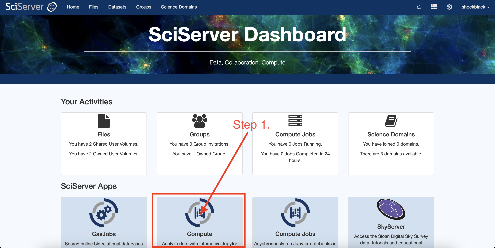
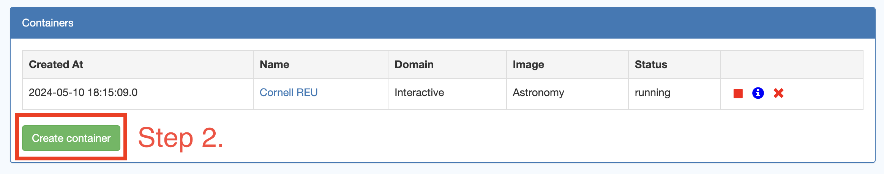
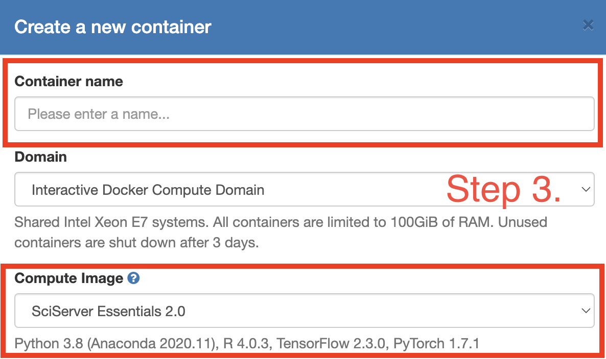
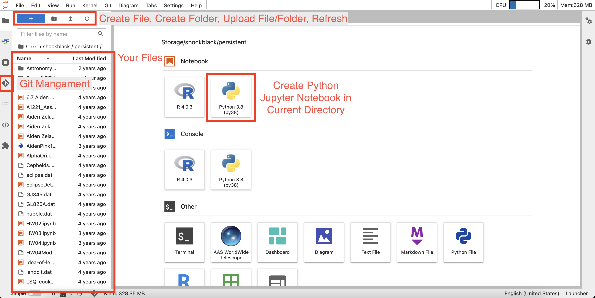

# Cornell Astronomy Python Bootcamp
##### By: Aiden Zelakiewicz (asz39@cornell.edu)


Welcome to the Python Bootcamp for Cornell University's Department of Astronomy. This bootcamp is primarily designed for the 2024 Research Experience for Undergraduates (REU) program, but is openly available to the wider Cornell Astronomy community. This bootcamp is heavily inspired by the [2022 Cornell REU](https://github.com/CUAstro-REU-Python-Workshop/2022-workshop) bootcamp, Ohio State Astronomy's [Python Bootcamp](https://github.com/giganano/PythonBootcamp) by James Johnson, and the OSU Astronomy 1221 and 3350 courses by Prof. Donald Terndrup.

What you are seeing currently are files in a GitHub repository, a great tool for version control and storage of code. The bootcamp focuses on using Jupyter Notebooks, which are an interactive way to run Python. Ideally, before the bootcamp, you will have Python installed on your local computer along with Jupyter. Otherwise, we will also introduce the free service [SciServer](https://apps.sciserver.org/) from which both Python scripts and Jupyter notebooks can be used. Everything you will do in this bootcamp can be done from SciServer, and maybe even most of the research you will do, but eventually getting Python installed locally will give you much greater flexibility.

## Before the Bootcamp

Before we begin the bootcamp, I would like you to figure out how you will be using Python and Jupyter. If you are comfortable with the terminal/using Python locally, you are free to do so. If you decide to use Python locally, I will recommend an Integrated Developement Environment (IDE) such as Microsoft's [Visual Studio Code](https://code.visualstudio.com/) (VSCode). This is personally where I (Aiden) do ALL of my coding and is the most community supported IDE available today. Once you learn VSCode, you will never go back as it is such a boon to coding in multiple languages at once with many customizable quality of life features, such as AI autocomplete, autobracketing, colorized indents, and so much more.

Things to do before the bootcamp begins are as follows:
1. Get Access To Python (details below)
2. Download/Clone the Repository (details below)
3. Go through [CrashCourseInPython.ipynb](code/BeforeBootcamp/CrashCourseInPython.ipynb) as a primer


### Getting Started with SciServer

SciServer is a tool hosted out of Johns Hopkins University and is a very easy and convenient way to begin coding with an emphasis on astronomy. Many astronomy databases, pipelines, and other useful tools come prebuilt into SciServer. Creating a SciServer account is free for everyone, so go ahead and make an account with a username you will remember and a secure password.

Once logged into SciServer, you will be greeted with a launch page that will look similar to the image below. You will want to click on the "Compute" button to begin (not "Compute Jobs").



From here you will see any containers you have created, which essentially your coding environments. Click on the "Create Container" button to make a new container. Name it whatever you would like, such as "Cornell REU" or "my silly codespace" if you are so inclined.



There will be choices for the "Compute Image" that will alter what kind of programs you have access to and how the Graphical User Interface (GUI) will appear. "SciServer Essentials 2.0" will give the classic SciServer layout that I personally learned Python on, while "SciServer Essentials 3.0" and "Astronomy" will give a JupyterLab like view. I will recommend using one of the latter two, as they are more up to date than the former. Once you have created a name and selected your image, scroll to the bottom and click "Create" while leaving everything else at the default.



Click your new container to open it. It will open in a new tab and likely present you with a JupyterLab window. On the left hand side you will see two volumes, "Storage" and "Temporary." As the names might suggest, "Storage" is for long term file storage and "Temporary" is for files that do not need to be kept long-term. "Temporary" is meant for storing large quantities of data and we will not enter into it here. Instead, you should ALWAYS code in the "Storage" container as that will last even if you are inactive (I have files in there from when I first coded with SciServer four years ago). Click into your username, then into the "persistent" folder. Your filepath should now look like "/Storage/\<Username\>/persistent/" which can be seen on the top of the left column where your files are managed.

There are many things you can do from this interactive JupyterLab window. On the left hand side you have a panel with various features such as your file locator and git management. On the top you can create and upload files and folders and refresh your file directory if something you added isn't showing up. In the center of the screen are some quick actions, such as creating a Jupyter notebook or accessing the terminal.



### Installing the Repository

To download this git repository (called "cloning") locally, you can either click the <mark style="background-color: #32CD32"><>Code</mark> dropdown menu and download the zip file. Alternatively, you can type this line into the terminal in a directory you want to files downloaded to:
```
$ git clone https://github.com/Shockblack/Python_Bootcamp.git
```
If you are on SciServer, on the left hand side of the JupyterLab environment there is the Git management button. From there, you can click the clone button and just paste in the URL for this repository. It will place the repo in the current directory/folder you are in.
```
https://github.com/Shockblack/Python_Bootcamp.git
```